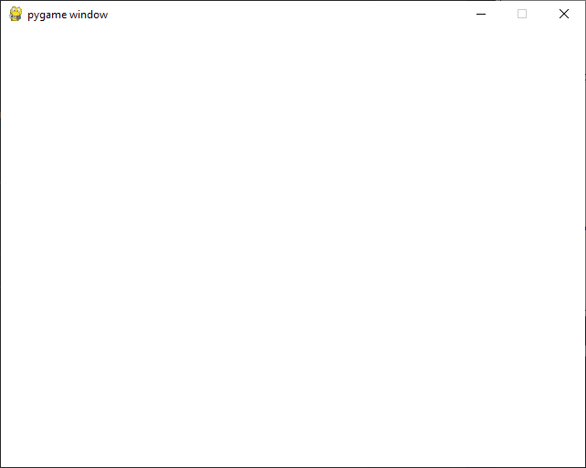
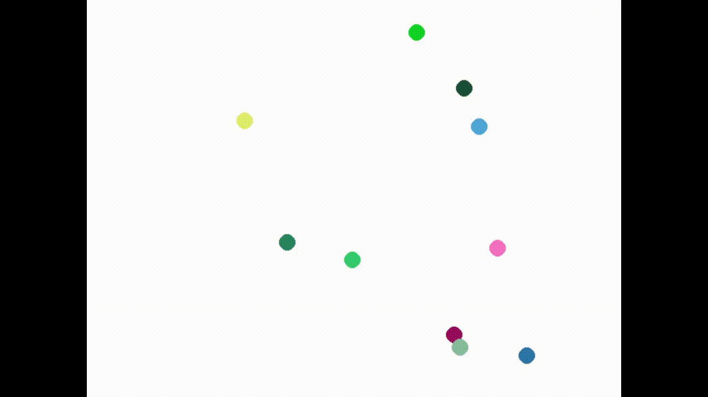

# Créer une interface graphique en Python avec Pygame

## Prérequis

### Installer Python

#### Windows
[How to Install Python 3.11.1 on Windows 10/11 [ 2023 Update ] Complete Guide](https://www.youtube.com/watch?v=yivyNCtVVDk&ab_channel=GeekyScript)

#### Linux
Avec votre app installer préféré, installez `python3`

### Installer Pygame
- Ouvrez un terminal (sous windows win+R > cmd > entrer, sous linux vous savez faire)

_(pour la suite, sous linux, remplacez **python** par **python3**)_
- Executez `python -m pip install --upgrade pip`
- Executez `python -m pip install pygame`

### Installer un IDE
Je vous conseil [VSCode](https://www.youtube.com/watch?v=cUAK4x_7thA&t=60s&ab_channel=HarsivoEdu)

Mais vous pouvez tout aussi bien utiliser Notepad++ ou même l'IDE de Python (que vous avez installé en même temps que Python)

## Commencer à coder

### La structure du programme

#### 1) Ouvrir une fenêtre

Pour cela, on à besoin d'importer Pygame, ce qu'on fait à la toute première ligne de notre programme.
Ensuite, on demande à Pygame d'ouvrir une fenêtre. La fonction `set_mode`, en plus d'ouvrir la fenêtre, retourne un objet de type [`Surface`](https://www.pygame.org/docs/ref/surface.html), l'image sur laquelle il faudra dessiner pour afficher des objets à l'écran.

```python
import pygame


# Ouvre une fenêtre Pygame de 640x480 pixels
screen = pygame.display.set_mode((640, 480))
```

#### 2) La boucle principale

C'est ici que tout ce passe. Pour ne pas se perdre, on décompose le travail en 3 étapes :
- La gestion des événements
- La mise à jour de nos objets
- Le rendu à l'écran

Les **événements** sont tout ce que peut faire l'utilisateur pour intéragir avec notre programme : bouger sa souris, appuyer sur une touche du clavier, etc

La partie **mise à jour** est l'endroit où la pluspart des calculs s'effectueront : c'est ici que l'ont fera boujer nos objets par exemple.

Enfin, le **rendus** et la partie où l'on s'occupera d'afficher à l'écran tous nos objets.


```python
# Un objet Clock pour gérer les IPS
clock = pygame.time.Clock()

# Boucle principale
running = True
while running:
    clock.tick(30) # On limite le nombre d'images à 30 par seconde

    # Gestion des événements
    ...

    # Mise à jour des objets
    ...

    # Rendu à l'écran
    ...
```

NB -  Pour ne pas que notre boucle tourne trop vite, on utilise un objet [`Clock`](https://www.pygame.org/docs/ref/time.html#pygame.time.Clock) de Pygame pour définir un nombre d'image par second maximum.

#### 3) Les événements

Tous les événements déclanchés par l'utilisateur sont stockés dans une file. À chaque tour de boucle, on vide la file et on traite les événements qui nous intéressent. Ici, on ne s'occupe que de ce qui ce passe quand quelqu'un ferme la fenètre de notre programme : on éteint tout.

```python
# Gestion des événements
for event in pygame.event.get():
    if event.type == pygame.QUIT: # Si l'utilisateur ferme la fenêtre
        running = False
```

Il existe beaucoup d'autres types d'événements, tous référencés ici : https://www.pygame.org/docs/ref/event.html

#### 4) Le rendus (partie 1)
Pygame, comme la pluspart des librairies graphiques, utilise un système de "double buffering" pour afficher du contenus à l'écran.


Pour faire simple, dessiner sur la surface `screen` ne se verra pas imédiatement à l'écran. Le rendu se décomposera donc en 2 temps :
- Tout dessiner sur le "Back Buffer"
- Échanger le "Back Buffer" et la surface principale

```python
# Rendu à l'écran
screen.fill((255, 255, 255)) # On remplit l'écran de blanc

...

pygame.display.flip() # Mise à jour de l'écran
```

Voilà un exemple simple : on remplit l'écrant de blanc, puis on l'affiche. Par la suite, quand on voudra dessiner plus de choses, on le fera entre ces 2 lignes. Si on dessine avant `screen.fill`, notre dessin sera recouvert de blanc, et si on dessine après `pygame.display.flip`, ça ne sera pas visible à l'ecran car dessiner dans le mauvais buffer.

#### 5) Petit test
À ce moment là, vous devriez pouvoir lancer le programme et une fenêter devrait s'ouvrir :


### Un exemple simple : Des balles qui bougent
Dans la suite, on va implémenter des balles qui rebondissent sur les bords de l'écran.

Voici un aperçu du resultat final :



#### 6) Le groupe camera
Pour pouvoir gérer toutes nos balles, Pygame met à notre disposition des [`Group`](https://www.pygame.org/docs/ref/sprite.html#pygame.sprite.Group).

Ce groupe nous permetera de gérer rapidement toutes les instances de nos balles.

```python
# Un groupe de sprites pour gérer tous nos objets
camera = pygame.sprite.Group()
```

#### 7) L'objet Ball
```python
class Ball(pygame.sprite.Sprite):
    
    def __init__(self, center, group):
        super().__init__(group)
        ...
        
    def update(self, dt):
        ...
        
    def render(self, screen):
        ...
```

Voilà notre objet représentant une balle. Avec Pygame, tous les objets affichés à l'écran sont des [`Sprite`](https://www.pygame.org/docs/ref/sprite.html#pygame.sprite.Sprite) : un objet plutôt générique que l'on va modifier un peu.

Il se décompose comme précédement, en 3 parties :
- Le constructeur `__init__`
- La méthode de mise à jour `update`
- La méthode d'affichage `render`

Le constructeur va nous servir à définir les attributs de notre balle. La ligne `super().__init__(group)` permet de gérer le lien entre notre version modifié _(classe enfant)_ du [`Sprite`](https://www.pygame.org/docs/ref/sprite.html#pygame.sprite.Sprite) et la version originale _(classe parente)_.

Dans la méthode `render`, on calculera tous ce qui nous sert à afficher notre objet.

Pour finir, dans `update`, on calculera tout le reste : position, collisions, etc...

#### 8) le constructeur `__init__()` :
Lorsque l'on va vouloir créer une balle, on veut :
- l'ajouter le groupe camera
- lui donner une position initiale
- lui donner une vitesse avec un angle aléatoire
- lui donner une couleur aléatoire
- définir sont rayon

Pour ajouter notre balle dans le groupe, on fait appelle à la classe parente : la ligne `super().__init__(group)` s'en occupe déjà : on a rien de plus à faire.

On va ensuite travailler avec 2 vecteurs : `pos` et `vel`. Pygame nous fournit une implémentation très complète de vecteurs en 2 dimension : [`Vector2`](https://www.pygame.org/docs/ref/math.html#pygame.math.Vector2) (ou 3 : [`Vector3`](https://www.pygame.org/docs/ref/math.html#pygame.math.Vector3))

On peut donc définir `self.pos` à notre position initiale : `center` et `self.vel` à un vecteur unitaire. Pour ensuite donner un angle aléatoire à notre vitesse, on utilise la méthode [`rotate_ip`](https://www.pygame.org/docs/ref/math.html#pygame.math.Vector2.rotate_ip) qui effectue une rotation de l'angle donnée (en degrés) à notre vecteur. 

```python
super().__init__(group)

self.pos = pygame.math.Vector2(center)

self.vel = pygame.math.Vector2(1, 0)
self.vel.rotate_ip(random.randint(0, 360))
self.speed = 0.5
```
_(pensez bien à ajouter la ligne `import random` au début du fichier)_

La gestion des couleurs s'effectue simplement avec des codes RGB : un triplet d'entiers compris entre 0 et 255. On défnit donc juste :
```python
self.color = (random.randint(0, 255), random.randint(0, 255), random.randint(0, 255))
```

Pour le rayon, on fait simple :
```python
self.radius = 10
```

#### 8) la méthode `render()`:
pour dessiner notre balle à l'écran, on a juste besoin d'appeller [`draw.circle`](https://www.pygame.org/docs/ref/draw.html#pygame.draw.circle) pour tracer un cercle :

```python
def render(self, screen):
    pygame.draw.circle(screen, self.color, self.pos, self.radius)
```

#### 8) la méthode `update()`:

On veut ici calculer la position de la balle après un interval de temps `dt`.
Pour cela, rien de plus simple
```python
self.pos += self.vel * dt * self.speed
```

Mais pour prendre en compte les rebonds sur les bords de l'écran, il faut avant cela faire appelle à Snell-Descartes :

```python
def update(self, dt):
    # Prévoit la position future de la balle
    future_x = self.pos.x + self.vel.x * dt * self.speed
    future_y = self.pos.y + self.vel.y * dt * self.speed
    
    # Fait rebondir la balle sur les bords de l'écran
    if future_x - self.radius < 0 or future_x + self.radius > screen.get_width():
        self.vel.x *= -1
    if future_y - self.radius < 0 or future_y + self.radius > screen.get_height():
        self.vel.y *= -1
        
    # Bouge la balle
    self.pos += self.vel * dt * self.speed
```

#### 9) Faire le lien entre nos objets et la boucle principale
On commence par instancier quelques balles 
```python
for _ in range(10):
    Ball(
        (screen.get_width() / 2, screen.get_height() / 2), # centre de l'écran
        camera
    )
```

puis dans la boucle principale, on met à jour nos balles
```python
# Mise à jour des objets
dt = clock.get_time()# Temps écoulé depuis le dernier tour de boucle (en ms)
camera.update(dt)
```

puis on les dessines :
```python
# Rendu à l'écran
screen.fill((255, 255, 255)) # On remplit l'écran de blanc

for sprite in camera.sprites():
    sprite.render(screen)
```

#### 10) C'est parti !
Normalement, arrivé ici, vous avez terminé et votre code devrait ressembler à ça :
```python
import random
import pygame


# Ouvre une fenêtre Pygame de 640x480 pixels
screen = pygame.display.set_mode((640, 480))

# Un objet Clock pour gérer les IPS
clock = pygame.time.Clock()

# Un groupe de sprites pour gérer tous nos objets
camera = pygame.sprite.Group()

class Ball(pygame.sprite.Sprite):
    
    def __init__(self, center, group):
        super().__init__(group)
        
        self.pos = pygame.math.Vector2(center)
        
        self.vel = pygame.math.Vector2(1, 0)
        self.speed = 0.5
        self.vel.rotate_ip(random.randint(0, 360))
        
        self.color = (random.randint(0, 255), random.randint(0, 255), random.randint(0, 255))
        
        self.radius = 10
        
    def update(self, dt):
        
        # Prévoit la position future de la balle
        future_x = self.pos.x + self.vel.x * dt * self.speed
        future_y = self.pos.y + self.vel.y * dt * self.speed
        
        # Fait rebondir la balle sur les bords de l'écran
        if future_x - self.radius < 0 or future_x + self.radius > screen.get_width():
            self.vel.x *= -1
        if future_y - self.radius < 0 or future_y + self.radius > screen.get_height():
            self.vel.y *= -1
            
        # Bouge la balle
        self.pos += self.vel * dt * self.speed
        
    def render(self, screen):
        pygame.draw.circle(screen, self.color, self.pos, self.radius)

# On instancie 10 balles au centre de l'écran
for _ in range(10):
    Ball(
        (screen.get_width() / 2, screen.get_height() / 2), # centre de l'écran
        camera
    )

# Boucle principale
running = True
while running:
    clock.tick(30) # On limite le nombre d'images à 30 par seconde
    
    # Gestion des événements
    for event in pygame.event.get():
        if event.type == pygame.QUIT: # Si l'utilisateur ferme la fenêtre
            running = False
            
    # Mise à jour des objets
    dt = clock.get_time()# Temps écoulé depuis le dernier tour de boucle (en ms)
    camera.update(dt)
    
    # Rendu à l'écran
    screen.fill((255, 255, 255)) # On remplit l'écran de blanc
    
    for sprite in camera.sprites():
        sprite.render(screen)
    
    pygame.display.flip() # Mise à jour de l'écran
```

Vous pouvez maintenant lancer le programme et admirer vos 10 balles multicolores rebondire !

## Ressources
- Documentation Pygame : https://www.pygame.org/docs/
- Un super tuto : https://www.youtube.com/watch?v=jO6qQDNa2UY&ab_channel=TechWithTim